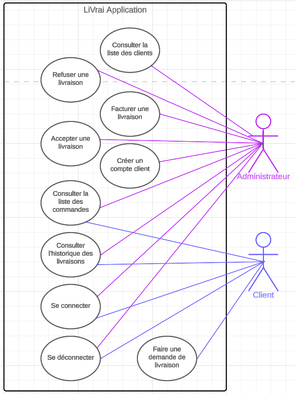
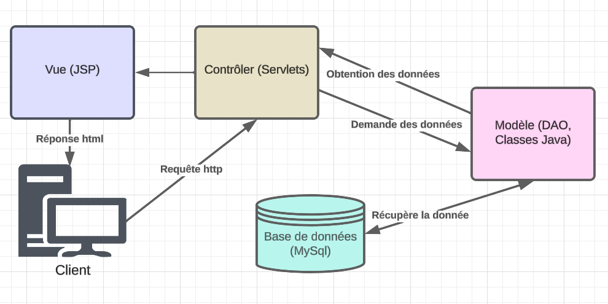

# Audit de l’application existante

## Contexte
L'application Livrai est conçue pour faciliter la gestion des livraisons. Elle s'inscrit dans le cadre de l'activité d'une entreprise de livraison, simplifiant les processus associés aux commandes, aux clients, et aux livraisons.

## Fonctionnalités
- **Authentification :** 
  * Connexion
  * Déconnexion
- **Livraisons :** 
  * Faire une demande de livraison
  * Visualiser l'état de la livraison
  * Visualiser les commandes
  * Accepter une livraison
  * Refuser une livraison
  * Facturer une livraison
- **Gestion des comptes**
  * Création de compte client
  * Voir les clients

## Expérience Utilisateur
L'expérience utilisateur actuelle présente des lacunes, notamment l'absence d'accès aux tarifs avant de passer une commande, l'absence du nom du produit commandé, et le manque d'informations sur les délais de livraison. De plus, les pages ne sont pas responsives, bien que la navigation soit facilitée par le faible volume d'informations sur chaque page.

## Description Technique

### Langages et Frameworks
- **JDK** 1.6
- **Java :** 6
- **JavaServer Pages (JSP) :**
- **Base de données :** MySQL 8
- **JDBC** mysql-connector-java 8

### Architecture
L'application suit une architecture MVC (Modèle-Vue-Contrôleur) avec des servlets Java pour la logique de contrôleur, des JSP pour la vue, et des classes Java pour les modèles de données.

### Points Forts
- Architecture MVC : La séparation des préoccupations est respectée avec l'utilisation du modèle MVC.
- Gestion des Utilisateurs : La gestion des utilisateurs, y compris l'authentification, est bien implémentée.
- Fonctionnalités Administratives : Les fonctionnalités administratives telles que l'acceptation, le refus et la facturation des livraisons sont bien gérées.

### Déficiences
- Design et Interface Utilisateur : L'interface utilisateur pourrait bénéficier d'une modernisation pour une meilleure expérience visuelle.
- Sécurité : La gestion des mots de passe des utilisateurs pourrait être renforcée par des pratiques de hachage plus sécurisées.
- Framework Java EE : L'utilisation d'un framework Java EE comme Spring pourrait simplifier le développement et améliorer la maintenabilité.
- Conditions de mot de passe peu strictes.
- Absence de pages responsives.
- Forte dépendance entre le frontend (JSP) et le backend (servlets Java), limite la modularité et l'adaptabilité, car les modifications dans l'un entraînent souvent des ajustements dans l'autre.

## Conclusion
En résumé, Livrai présente une base solide avec son architecture MVC et ses fonctionnalités administratives bien intégrées. Cependant, des lacunes significatives dans l'expérience utilisateur, la sécurité et la dépendance entre le frontend et le backend nécessitent une attention immédiate. Des améliorations ciblées dans ces domaines contribueront à renforcer l'efficacité et la modernité de l'application, assurant ainsi une meilleure satisfaction des utilisateurs.
