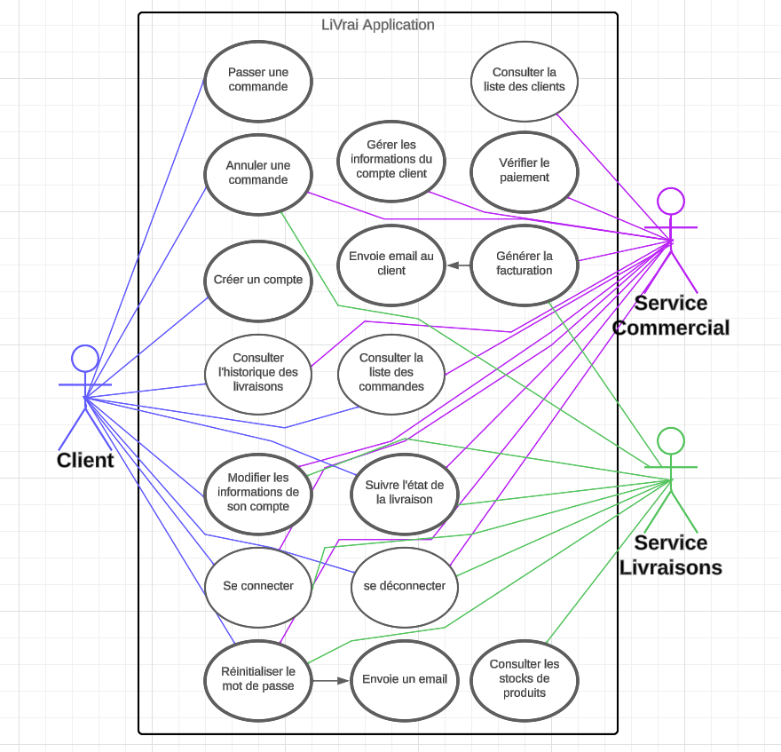

# Cahier des charges

## Contexte du projet

- Besoins du client

LiVrai désire refaire entièrement son application pour permettre à ses clients d'être autonomes dans l'utilisation du service de livraison. Les clients pourront créer leur compte, gérer leurs informations, passer des commandes, suivre les livraisons, gérer la facturation, et consulter l'historique des livraisons. Le service commercial continuera à gérer certains clients et aura accès à la facturation, tandis que le service de livraisons gérera les livraisons et aura également accès à la facturation.

## Présentation de l’activité de l’entreprise et de la solution existante

LiVrai, avec 150 employés, propose actuellement un service de livraison de marchandises en grande quantité pour les professionnels. L'application actuelle, développée il y a plusieurs années, nécessite une mise à jour pour répondre aux nouveaux besoins de l'entreprise.

## Limites de la solution existante

La solution actuelle nécessite l'intervention du service commercial pour la création des comptes clients et la gestion des livraisons. Elle ne permet pas aux clients d'être autonomes dans l'utilisation du service de livraison.

## Objectifs du projet

L'objectif principal est de refondre l'application de gestion des clients (CRM) pour permettre aux clients d'être autonomes dans l'utilisation du service de livraison. Les objectifs spécifiques incluent la création de compte par les clients ou le service commercial, la gestion des informations clients, la commande et le suivi des livraisons, la gestion de la facturation, et la mise en place d'un historique des livraisons.

## Mesure de la réussite du projet

La réussite du projet sera mesurée par la capacité de l'application à permettre aux clients d'être autonomes, la réduction du travail du service commercial pour certains clients, et la facilitation du processus global de livraison.

## Contraintes réglementaires

- Consentement explicite : Obtention claire du consentement des utilisateurs lors de la création de compte, avec une option d'acceptation ou de refus.
- Droit à l'information : Communication préalable d'une politique de confidentialité détaillée avant le consentement.
- Droit à l'effacement : Possibilité simple pour les utilisateurs de supprimer leurs données via les paramètres du compte.

## Éléments hors périmètre

- **Pas de Retours dans l'Application :** La gestion des retours de produits n'est pas incluse.

- **Litiges non Couverts :** La résolution des litiges et des réclamations ne fait pas partie des fonctionnalités actuelles.

- **Remboursement Hors Application :** Les politiques de remboursement pour les retours ne sont pas gérées dans LiVrai.

## Description fonctionnelle

### Liste des fonctionnalités

#### Création de compte

- **Description:** Permet aux clients et au service commercial de créer des comptes.
- **Besoin client:** Offrir une méthode d'inscription pour accéder aux fonctionnalités de l'application.

#### Gestion des informations clients

- **Description:** Permet aux clients et au service commercial de gérer les informations liées aux comptes.
- **Besoin client:** Faciliter la mise à jour des données clients et assurer une gestion efficace par le service commercial.

#### Commande et suivi des livraisons

- **Description:** Permet aux clients de passer des commandes et de suivre l'état des livraisons en temps réel.
- **Besoin client:** Autonomiser les clients dans le processus de commande et fournir une visibilité sur les livraisons.

#### Gestion de la facturation

- **Description:** Permet au service commercial et au service de livraisons d'accéder à la facturation.
- **Besoin client:** Simplifier le processus de facturation tout en assurant un suivi transparent des transactions.

#### Historique des livraisons

- **Description:** Fournit un accès à l'historique détaillé des livraisons pour les clients.
- **Besoin client:** Offrir une référence pratique pour les clients afin de suivre et de rappeler les livraisons antérieures.

## Fonctionnement de l’application

- **Pour les Clients :**

- Création de Compte : Inscription facile.
- Passation de Commande : Sélection rapide des produits.
- Suivi des Livraisons : Localisation en temps réel.
- Historique des Livraisons : Consultation détaillée.
- Modification des Infos : Mise à jour des données personnelles.

- **Pour le Service Commercial :**

- Admin des Infos Client : Gestion des données client.
- **Pour le Service Commercial et le Service Livraisons :**
- Gestion de la Facturation : Création et suivi des factures.

# Impact Social

## Environnemental

- Optimisation des trajets de livraison pour réduire l'empreinte carbone.
- Utilisant des emballages recyclables
- Minimisation des déplacements inutiles pour contribuer à la préservation de l'environnement.

## Accessibilité pour les Publics en Situation de Handicap

- Adaptation des contrastes visuels pour répondre aux besoins spécifiques.
- Options de taille de texte ajustables pour garantir une expérience inclusive.
- Écoute continue des retours des utilisateurs pour améliorer constamment l'accessibilité.

## Description technique

Présenter l’ensemble des technologies utilisées en les justifiant. Inclure un diagramme de l’architecture de l’application.
