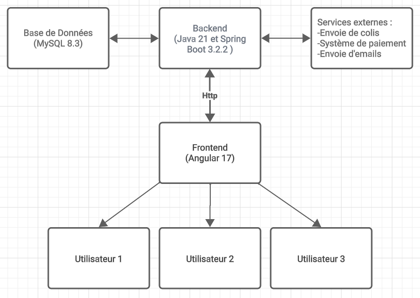
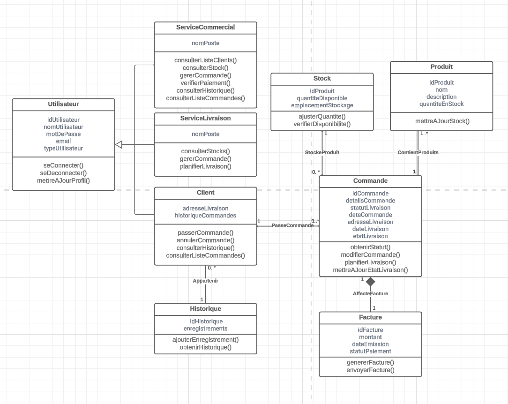

# Cahier des charges

## Contexte du projet

- Besoins du client

LiVrai désire refaire entièrement son application pour permettre à ses clients d'être autonomes dans l'utilisation du service de livraison. Les clients pourront créer leur compte, gérer leurs informations, passer des commandes, suivre les livraisons, gérer la facturation, et consulter l'historique des livraisons. Le service commercial continuera à gérer certains clients et aura accès à la facturation, tandis que le service de livraisons gérera les livraisons et aura également accès à la facturation.

## Présentation de l’activité de l’entreprise et de la solution existante

LiVrai, avec 150 employés, propose actuellement un service de livraison de marchandises en grande quantité pour les professionnels. L'application actuelle, développée il y a plusieurs années, nécessite une mise à jour pour répondre aux nouveaux besoins de l'entreprise.

## Limites de la solution existante

La solution actuelle nécessite l'intervention du service commercial pour la création des comptes clients et la gestion des livraisons. Elle ne permet pas aux clients d'être autonomes dans l'utilisation du service de livraison.

## Objectifs du projet

L'objectif principal est de refondre l'application de gestion des clients (CRM) pour permettre aux clients d'être autonomes dans l'utilisation du service de livraison. Les objectifs spécifiques incluent la création de compte par les clients ou le service commercial, la gestion des informations clients, la commande et le suivi des livraisons, la gestion de la facturation, et la mise en place d'un historique des livraisons.

## Mesure de la réussite du projet

La réussite du projet sera mesurée par la capacité de l'application à permettre aux clients d'être autonomes, la réduction du travail du service commercial pour certains clients, et la facilitation du processus global de livraison.

## Contraintes réglementaires

- Consentement explicite : Obtention claire du consentement des utilisateurs lors de la création de compte, avec une option d'acceptation ou de refus.
- Droit à l'information : Communication préalable d'une politique de confidentialité détaillée avant le consentement.
- Droit à l'effacement : Possibilité simple pour les utilisateurs de supprimer leurs données via les paramètres du compte.

## Éléments hors périmètre

- **Pas de Retours dans l'Application :** La gestion des retours de produits n'est pas incluse.

- **Litiges non Couverts :** La résolution des litiges et des réclamations ne fait pas partie des fonctionnalités actuelles.

- **Remboursement Hors Application :** Les politiques de remboursement pour les retours ne sont pas gérées dans LiVrai.

## Description fonctionnelle

### Liste des fonctionnalités

#### Création de compte

- **Description:** Permet aux clients de créer des comptes.
- **Besoin client:** Permet aux clients de prendre le contrôle de leur expérience de service en s'inscrivant facilement. Cela réduit la dépendance vis-à-vis du service commercial et offre une flexibilité et une autonomie accrues pour les utilisateurs.

#### Gestion des informations clients

- **Description:** Permet aux clients et au service commercial de gérer les informations liées aux comptes.
- **Besoin client:** Assure que les clients peuvent maintenir leurs informations à jour, ce qui est crucial pour la précision de la livraison et la communication. Cela améliore également la relation client en rendant le service plus personnalisé et réactif.

#### Commande et suivi des livraisons

- **Description:** Permet aux clients de passer des commandes et de suivre l'état des livraisons en temps réel.
- **Besoin client:** Offre une transparence totale et un contrôle sur le processus de commande et de livraison. Les clients peuvent planifier et ajuster leur emploi du temps en fonction de leurs commandes, sécurisant ainsi la réception des colis et améliorant ainsi leur satisfaction globale.

#### Générer la facturation

- **Description:** Permet au service commercial et au service de livraison de générer et d'envoyer une facture.
- **Besoin client:** Simplifier le processus de facturation. Ce qui augmente la performance des services, leur permettant ainsi de faire plus de traitements grace à cette automatisation.

#### Gestion des Stocks
- **Description:** Permet au service de livraisons de gérer et de suivre les niveaux de stock des produits.
- **Besoin client:** Assure que les clients sont informés de la disponibilité des produits, permettant une planification et une commande plus précises. Cela contribue à éviter les déceptions liées à des commandes non satisfaites et améliore l'efficacité opérationnelle.

#### Historique des livraisons

- **Description:** Fournit un accès à l'historique détaillé des livraisons pour les clients.
- **Besoin client:** Permet aux clients de revoir leurs commandes précédentes pour une meilleure gestion de leurs achats et une facilité de réapprovisionnement. Cela contribue également à bâtir une relation transparente et de confiance avec les clients.

#### Consulter la Liste des Commandes

- **Description:** Permet aux clients et au service commercial de visualiser les commandes passées et en cours.
- **Besoin client:** Offre une vue d'ensemble et un suivi facile des commandes, permettant aux clients de planifier et de gérer leurs besoins en livraison. Pour le service commercial, cela permet une meilleure gestion des commandes et une réponse rapide aux demandes des clients.

#### Consulter la Liste des Clients

- **Description:** Donne accès au service commercial à la liste complète des clients, incluant les détails de leurs comptes.
- **Besoin client:** Facilite une approche personnalisée et ciblée dans la relation client, permettant au service commercial de mieux comprendre et répondre aux besoins spécifiques de chaque client.

#### Vérifier le Paiement

- **Description:** Permet au service commercial de confirmer les paiements effectués par les clients pour leurs commandes.
- **Besoin client:** Assure une gestion financière transparente et fiable. Cela contribue à renforcer la confiance des clients envers LiVrai en garantissant que leurs transactions sont traitées de manière sécurisée et efficace.

## Fonctionnement de l’application

#### Fonctionnalités pour le Client
- **Passer Commande :** Sélectionner et commander des produits ou services.
- **Créer un Compte :** S'inscrire pour accéder aux services offerts par LiVrai.
- **Consulter l'Historique des Livraisons :** Voir un historique détaillé des livraisons précédentes.
- **Consulter la Liste des Commandes :** Visualiser les commandes passées et en cours.

#### Fonctionnalités pour le Service Commercial
- **Consulter la Liste des Clients :** Accéder à la liste complète des clients et à leurs détails.
- **Vérifier le Paiement :** Confirmer les paiements des commandes des clients.
- **Gérer les Informations du Compte Client :** Mettre à jour et maintenir les informations des comptes clients.
- **Consulter l'Historique des Livraisons :** Accéder à l'historique des livraisons pour chaque client.
- **Consulter la Liste des Commandes :** Visualiser les détails des commandes passées et en cours.

#### Fonctionnalités pour le Service Livraison
- **Consulter les Stocks :** Vérifier les niveaux de stock actuels pour une gestion efficace des ressources.

#### Fonctionnalités pour les Services (Commercial et Livraison)
- **Générer la Facturation :** Créer des factures pour les commandes, déclenchant l'envoi d'un email au client.

#### Fonctionnalités Communes (Clients, Service Commercial, Service Livraison)
- **Se Connecter :** Accès sécurisé à leur compte respectif.
- **Se Déconnecter :** Option de se déconnecter de l'application pour la sécurité du compte.
- **Réinitialiser le Mot de Passe :** Modifier le mot de passe, déclenchant l'envoi d'un email de réinitialisation.
- **Suivre l'État de la Livraison :** Accès à des informations en temps réel sur le statut des livraisons.
- **Modifier les Informations du Compte :** Mettre à jour les informations personnelles et de contact dans leurs comptes.
- **Annuler une Commande :** Annuler une commande en cours avant son expédition.

# Impact Social

## Environnemental

- Optimisation des trajets de livraison pour réduire l'empreinte carbone.
- Utilisant des emballages recyclables
- Minimisation des déplacements inutiles pour contribuer à la préservation de l'environnement.

## Accessibilité pour les Publics en Situation de Handicap

- Adaptation des contrastes visuels pour répondre aux besoins spécifiques.
- Options de taille de texte ajustables pour garantir une expérience inclusive.
- Écoute continue des retours des utilisateurs pour améliorer constamment l'accessibilité.

## Description technique

### Technologies Utilisées

#### Frontend
- **Angular :** Utilisé pour développer une Single Page Application (SPA) moderne et interactive. Angular offre une expérience utilisateur fluide, une meilleure performance, et facilite le développement d'interfaces utilisateur riches et dynamiques.

#### Backend
- **Java (Dernière version LTS) :** Choisi pour sa robustesse, sa sécurité, et sa portabilité. Java est largement utilisé pour le développement d'applications d'entreprise en raison de sa maturité, de son écosystème riche, et de son support communautaire étendu.

#### Base de données
- **MySQL :** Une base de données relationnelle choisie pour sa fiabilité, sa performance, et sa compatibilité avec Java. MySQL est idéale pour gérer les données transactionnelles et relationnelles de l'application.

#### Serveur d'application
- **Spring Boot :** Un framework pour simplifier le processus de configuration et de déploiement des applications Java. Il offre une intégration facile avec des bases de données et des services tiers, tout en supportant une architecture RESTful pour le backend.

#### Sécurité
- **Spring Security :** Pour la gestion de l'authentification et de l'autorisation, offrant des fonctionnalités robustes pour sécuriser l'application contre les menaces courantes.

#### Intégration et déploiement continus
- **Docker :** Utilisé pour containeriser l'application, ce qui facilite le déploiement, la mise à l'échelle et la gestion de l'environnement d'exécution.

### Justification des Choix Technologiques

- **Angular :** Permet une interaction client riche et une meilleure expérience utilisateur.
- **Java :** Langage maîtrisé par l'équipe de développement, assurant une courbe d'apprentissage minimale et une maintenance aisée.
- **MySQL :** Offre une gestion efficace des données et est largement adoptée dans l'industrie, ce qui en fait un choix fiable.
- **Spring Boot & Spring Security :** Fournissent une base solide pour construire des applications sécurisées, bien structurées, et maintenables.
- **Docker :** Assure une portabilité et une cohérence entre les environnements de développement, de test et de production.

#### Avantages de l'Architecture Client-Serveur pour LiVrai :
**Simplicité et Clarté**
    - Structure intuitive qui simplifie le développement, le déploiement et le débogage.
    - Séparation claire entre le frontend (Angular) et le backend (Java).
**Centralisation de la Logique Métier**
    - Toutes les opérations clés sont gérées de manière cohérente et centralisée sur le serveur.
    - Facilite les mises à jour systématiques et la gestion des données.
**Sécurité Renforcée**
    - Le serveur agit comme un intermédiaire sécurisé entre le client et la base de données.
    - Améliore la sécurité des données et la validation des requêtes.

**Compatibilité avec les Technologies Requises**
    -Parfaitement alignée avec Java pour le backend et Angular pour le frontend.

